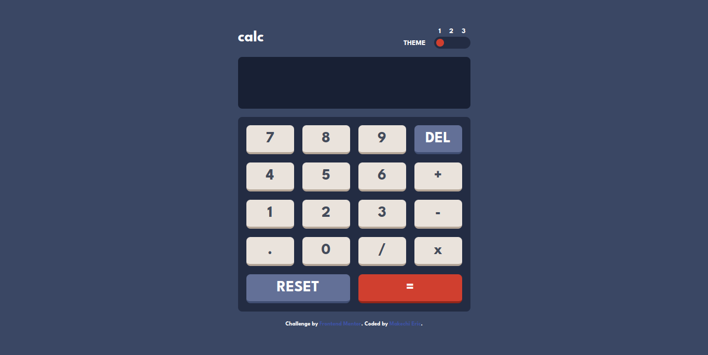
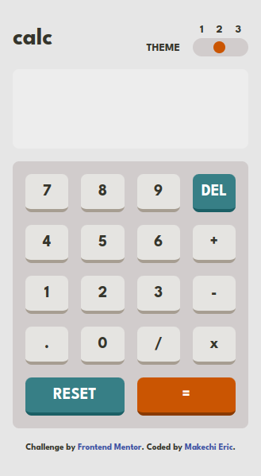

# Frontend Mentor - Calculator app solution

This is a solution to the [Calculator app challenge on Frontend Mentor](https://www.frontendmentor.io/challenges/calculator-app-9lteq5N29). Frontend Mentor challenges help you improve your coding skills by building realistic projects. 

## Table of contents

- [Overview](#overview)
  - [The challenge](#the-challenge)
  - [Screenshot](#screenshot)
  - [Links](#links)
- [My process](#my-process)
  - [Built with](#built-with)
- [Author](#author)

## Overview

### The challenge

Users should be able to:

- See the size of the elements adjust based on their device's screen size
- Perform mathematical operations like addition, subtraction, multiplication, and division
- Adjust the color theme based on their preference
- **Bonus**: Have their initial theme preference checked using `prefers-color-scheme` and have any additional changes saved in the browser

### Screenshot

### Links

- Solution URL: [Solution Link](https://www.frontendmentor.io/challenges/calculator-app-9lteq5N29/hub?share=true)
- Live Site URL: [Live Site](https://calculator-app-eta-five.vercel.app/)

## My process

### Built with

- Flexbox
- CSS Grid
- Mobile-first workflow
- [React](https://reactjs.org/) - JS library
- Tailwind CSS

## Author

- Website - [Makechi Eric](https://love-makechi.web.app)
- Frontend Mentor - [@Makechi02](https://www.frontendmentor.io/profile/Makechi02)
- Twitter - [@OEMakbe](https://www.twitter.com/OEMakbe)